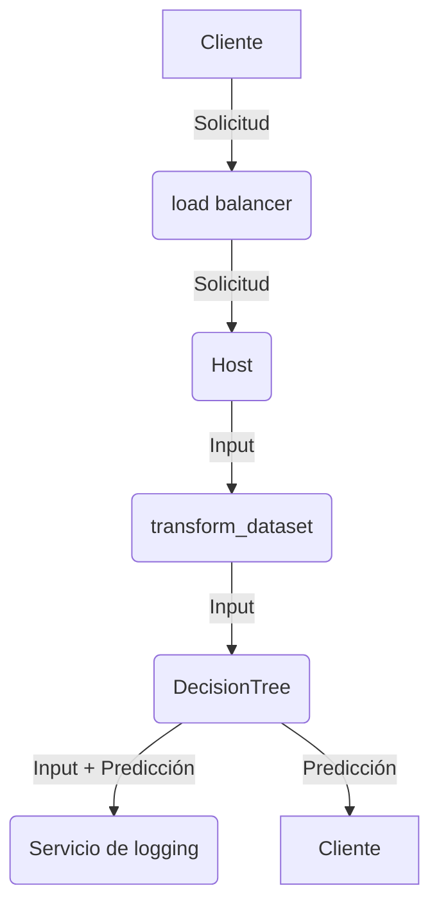

# Modelo de predicción de tipo de pase

**Autor** Andrés Alam Sánchez Torres

## Instalación del ambiente

El servidor de jupyter se puede iniciar usando Docker:

```bash
docker compose up
```

Si los datasets no se encuentran disponibles en el espacio de trabajo, se usa la api de kaggle para descargarlos del concurso.
Se necesita pasar las credenciales de Kaggle como variables de entorno, ver `.env.example`.


## Flujo de trabajo

La notebook se divide en dos secciones que se subdividen:

- Análisis exploratorio: Describe el proceso que se llevó a cabo para conocer la estructura de los datos, remover outliers, datos "inválidos", e identificar ciertas tendencias y/o relaciones.
    - Carga de datos: Muestra el proceso necesario para obtener los datasets.
    - Limpieza: Hace la limpieza necesaria para hacer el análisis. Se eliminaron o rellenaron datos nulos, se extrajeron más features como componentes de las fechas y distancias entre estaciones.
    ' Observaciones: Se muestran las tendencias y asociaciones que se encontraron y que posteriormente se usaron para decidir las features.
- Construcción del modelo: Describe la construcción del modelo de ML, probando diferentes alternativas.


## Despliegue

El modelo se puede llevar a producción a través de un endpoint REST. Para ello se aislan los métodos para preparar los datos para el modelo, y el modelo en sí:

1. Se utiliza la función `transform_dataset` de la sección de construcción del modelo para transformar los datos de entrada.
2. Los datos de entrada se propagan al modelo seleccionado con mejor rendimiento, en este caso, un Decision Tree.
3. Se regresa en el cuerpo de la respuesta del endpoint la predicción del modelo.

El servicio se puede extender aún más agregando múltiples instancias detrás de un balanceador de carga y un historial de las solicitudes entrantes. Registrar las solicitudes brindaría más datos para comprender el problema, y potencialmente tener más datos de entrenamiento dependiendo de cómo funcione el servicio. El flujo para el uso del servicio se vería de la siguiente forma:


 


